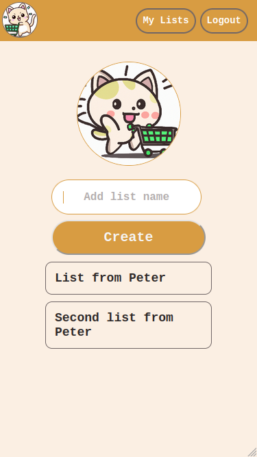
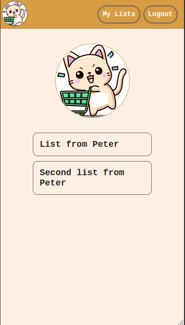
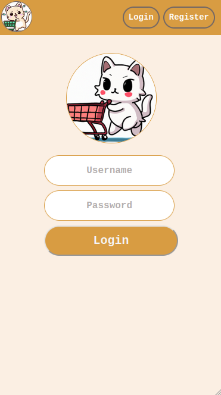
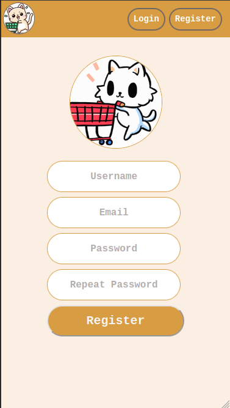

# Purrfect List

### Features

1. Login.
2. Logout.
3. Register.
4. Create own lists.
5. Add product to custom lists
6. Add product.
7. Delete product.

### To Do:

1. Shared lists for more users.
2. Create products in private lists for invited users.
3. Notifications.
4. More&hellip;

### Live demo

[Try it here :)](https://purrfectlist.netlify.app/)

### Description

In this small shopping list project I'm using [back4app](https://www.back4app.com/) for the backend and [netlify](https://www.netlify.com/) to deploy app.

### What I got from this project

1. Setting up back4app environment.
2. Use their rest api.
3. Async requests to the rest api.
4. CRUD operations.
5. Deploying the app on the web using netlify.

### Preview

 

