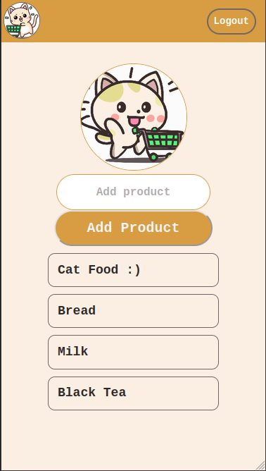
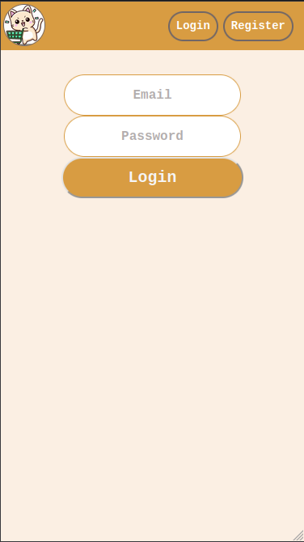
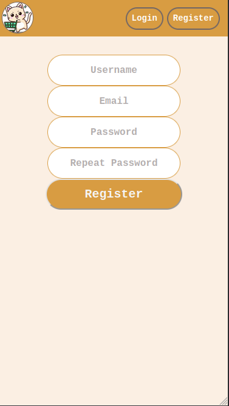

# Purrfect List

### Features

1. Login.
2. Logout.
3. Register.
4. Add product.
5. Delete product.

### To Do:

1. Create private lists for registered users.
2. Send invite to private lists.
3. Create products in private lists for invited users.
4. More&hellip;

### Live demo

[Try it here :)](https://purrfectlist.netlify.app/)

### Description

In this small project I'm using [back4app](https://www.back4app.com/) for the backend and [netlify](https://www.netlify.com/) to deploy app.

### What I get from this project

1. Setting up back4app environment.
2. Use their rest api.
3. Async requests to the rest api.
4. CRUD operations.
5. Deploying the app in the web using netlify.

### Preview

 

